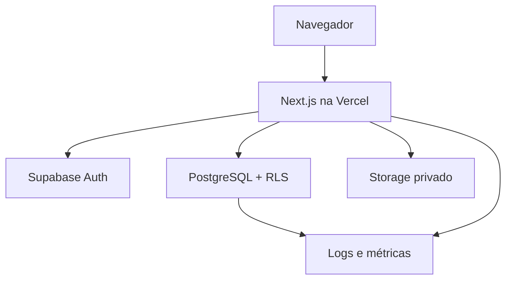

# Arquitetura do sistema

## 1. Contexto e objetivos

A solução é uma aplicação web multi-tenant para fatos financeiros e operacionais. As prioridades arquiteturais são: isolamento no banco, precisão decimal, transações para fatos compostos, histórico reproduzível, evolução por migrations e execução em Vercel + Supabase.

Stack acordada: Next.js App Router, React, TypeScript estrito, Tailwind CSS v4, Supabase Auth/PostgreSQL/Storage/RLS, Vitest e Vercel.

## 2. Visão de componentes



- O navegador renderiza UI e envia intenções validadas; nunca contém credencial privilegiada.
- Server Components carregam dados quando isso reduz exposição/cascatas. Client Components ficam nas bordas interativas.
- Route Handlers/Server Actions são fronteiras confiáveis para orquestração, segredos server-only e mutações compostas.
- Funções PostgreSQL `security invoker`/RPC transacionais consolidam operações que precisam ser atômicas, como receber compra e confirmar lote.
- RLS é aplicada mesmo quando a requisição passa pelo servidor; chave de serviço não é o caminho padrão.

## 3. Organização do código

```text
src/
  app/
    (auth)/                 # entrada, cadastro, callback e recuperação
    (app)/                  # shell autenticado e rotas de produto
    api/                    # handlers somente quando a fronteira HTTP é necessária
  components/               # design system e composição compartilhada
  features/
    organizations/ ingredients/ purchases/ recipes/ pricing/
    inventory/ production/ reports/ settings/
  lib/
    calculations/           # funções puras, decimais e testadas
    supabase/               # clientes browser/server, tipos e queries comuns
    validation/             # schemas de entrada/saída
    auth/                   # contexto, guards e capacidades de UI
    observability/          # erro, correlação e eventos não sensíveis
supabase/
  migrations/               # schema, constraints, RLS, funções e seeds não sensíveis
tests/
  unit/ integration/ e2e/   # ou testes co-localizados, conforme runner configurado
```

Regras:

- `src/app` compõe páginas; não implementa fórmulas financeiras.
- `src/features` contém componentes, casos de uso e contratos por domínio.
- `src/lib/calculations` não acessa UI ou rede e recebe decimais/unidades explícitas.
- `src/lib/supabase` não decide regras financeiras; traduz acesso persistente e erros.
- Nenhum feature importa detalhe interno de outro; usa contrato exportado ou serviço compartilhado.

## 4. Modelo de dados lógico

Toda tabela de tenant inclui `organization_id`, timestamps e, quando aplicável, `created_by`, `status` e `archived_at`. Chaves UUID não substituem a verificação de tenant. FKs compostas ou triggers/constraints garantem que referências permaneçam na mesma organização.

| Área       | Entidades mínimas                                                                                                    | Invariantes principais                                                  |
| ---------- | -------------------------------------------------------------------------------------------------------------------- | ----------------------------------------------------------------------- |
| Identidade | `organizations`, `branches`, `memberships`, `roles`, `permissions`                                                   | membership única; filial no mesmo tenant; último admin protegido        |
| Catálogo   | `measurement_units`, `unit_conversions`, `ingredient_categories`, `ingredients`, `suppliers`, `ingredient_suppliers` | dimensões compatíveis; rendimento válido; arquivamento em uso           |
| Compras    | `purchases`, `purchase_items`, `ingredient_price_history`, `attachments`                                             | totais não negativos; confirmação idempotente; snapshot de rateio/custo |
| Receitas   | `recipes`, `recipe_versions`, `recipe_ingredients`, `recipe_sub_recipes`, `packaging_items`, `recipe_packaging`      | versão publicada imutável; grafo acíclico; rendimento positivo          |
| Custos     | `expenses`, `cost_centers`, `allocation_rules`, `sales_channels`, `channel_fees`, `taxes`                            | base da taxa explícita; vigência sem ambiguidade                        |
| Preços     | `pricing_rules`, `product_prices`, `scenarios`                                                                       | versão/custo/canal snapshotados; denominador positivo                   |
| Estoque    | `inventory_locations`, `stock_movements`, `inventory_balances`                                                       | livro imutável; saldo derivável; idempotência/origem única              |
| Produção   | `production_batches`, `production_consumption`, `production_losses`                                                  | receita/versionamento fixos; confirmação atômica                        |
| Governança | `alerts`, `audit_logs`                                                                                               | ator/contexto; cliente não altera log crítico                           |

### Estratégia temporal e histórica

- Cadastros mutáveis podem ser arquivados, mas fatos confirmados não são apagados.
- Versões de receita publicadas e preços vigentes têm `valid_from`/`valid_to` ou status equivalente.
- Compra, lote e preço guardam referências e snapshots dos valores necessários à reprodução.
- Correção de fato usa reversão/compensação ligada ao original.
- Datas-instantâneas são `timestamptz`; datas de competência/lote são `date` no timezone de negócio explicitado.

### Índices mínimos

- `(organization_id, id)` e FKs usadas por políticas.
- `(organization_id, status, updated_at)` para listas operacionais.
- `(organization_id, ingredient_id, occurred_at desc)` em histórico/movimentos.
- `(organization_id, recipe_id, version_number)` único.
- Chaves idempotentes únicas por `(organization_id, operation_type, idempotency_key)` quando aplicável.
- Índices devem ser confirmados por `EXPLAIN (ANALYZE, BUFFERS)` com volume representativo; não criar índices sem consulta consumidora.

## 5. Segurança e autorização

### Contexto de tenant

1. Supabase Auth fornece `auth.uid()`.
2. A membership ativa liga usuário e organização/papel.
3. Toda política verifica a membership e capacidade necessária, além do `organization_id` da linha.
4. Funções privilegiadas validam novamente ator, tenant, papel e integridade dos argumentos.

### Matriz RLS por classe

| Classe                    | SELECT                                                | INSERT/UPDATE                                     | DELETE                                        |
| ------------------------- | ----------------------------------------------------- | ------------------------------------------------- | --------------------------------------------- |
| Cadastros do tenant       | membership com capacidade de leitura                  | capacidade de edição e `WITH CHECK` no tenant     | preferir arquivamento; admin quando permitido |
| Fatos financeiros/estoque | leitura autorizada                                    | somente função transacional/capacidade específica | negar; usar reversão                          |
| Memberships/papéis        | admin do tenant; própria membership limitada          | admin, sem escalada/órfão                         | regra do último admin                         |
| Auditoria                 | admin/auditor                                         | trigger/função confiável                          | negar ao cliente                              |
| Storage                   | caminho/bucket vinculado ao tenant e linha autorizada | capacidade do recurso e tipo/tamanho              | arquivar/remover conforme retenção            |

Testes devem usar dois tenants e, no mínimo, admin/gestor/operação/visualizador. A ausência de linha na UI não prova isolamento: executar tentativas diretas de `select`, `insert`, `update`, RPC e URL de Storage.

### Controles adicionais

- `SUPABASE_SERVICE_ROLE_KEY` é server-only, usada somente para tarefas administrativas justificadas.
- CSP/headers, cookies seguros, redirects/callbacks allowlisted e URLs derivadas de configuração validada.
- Schemas validam entrada no servidor; constraints asseguram invariantes no banco.
- Mensagens externas não retornam SQL, policy ou stack; log recebe correlação sem PII/segredo.
- Dependências, bundle e repositório são varridos antes de release.

## 6. Arquitetura de cálculos

### Tipos e precisão

- PostgreSQL usa `numeric`, com escala definida por coluna; quantidade precisa de mais casas que exibição monetária.
- TypeScript usa uma biblioteca decimal única ou strings decimais nas fronteiras; nunca calcula dinheiro com `number` nativo.
- Por padrão: dinheiro intermediário 6 casas, quantidades/conversões 9 e percentuais como fração com pelo menos 6; o schema definitivo documenta cada coluna.
- Arredondamento comercial inicial: `half-up` para exibição/liquidação a 2 casas. Exceções fiscais exigem decisão registrada.

### Contratos puros

| Serviço-alvo     | Entradas essenciais                                                     | Saídas/evidência                         |
| ---------------- | ----------------------------------------------------------------------- | ---------------------------------------- |
| `ingredientCost` | compra, adicionais, desconto, quantidade, rendimento, conversão, método | custo bruto/usável e decomposição        |
| `recipeCost`     | versão, componentes com custo/unidade, rendimento, rateios              | total, unidade/porção/kg/l, decomposição |
| `pricing`        | custos monetários, taxas fixas, percentuais e margem                    | mínimo/alvo, lucro, markup e margens     |
| `breakEven`      | custos fixos, contribuição unitária/média, período                      | receita, unidades e metas por período    |
| `scenario`       | baseline imutável + deltas explícitos                                   | comparação com baseline e premissas      |

Cada função deve rejeitar `NaN`, infinito, unidade incompatível, quantidade/rendimento inválido e divisor `≤0`. Resultados transportam valor de alta precisão e arredondado para exibição, com fórmula/partes suficientes para explicação.

### Fórmulas normativas

```text
usable_quantity = gross_quantity × yield_fraction
usable_unit_cost = (purchase_amount + allocated_freight + taxes + fees - discounts)
                   / usable_quantity

recipe_cost = ingredients + subrecipes + packaging + direct_labor
              + direct_variable_costs + allocated_indirect_costs

selling_price = (recipe_cost + fixed_per_sale_costs)
                / (1 - percentage_charges - target_margin)

gross_margin = (selling_price - cost_of_goods) / selling_price
contribution_margin = (selling_price - variable_costs) / selling_price
markup_multiplier = selling_price / applicable_cost
break_even_units = fixed_costs / contribution_per_unit
```

Alocação, base tributária e escopo de custo devem acompanhar os valores; somar percentuais ao custo não substitui a fórmula do divisor.

## 7. Consistência, transações e concorrência

- Recebimento de compra e confirmação/cancelamento de produção são funções transacionais no banco.
- Idempotency key impede duplicação em retry; resposta reaproveita o fato existente.
- Atualizações de rascunho usam `updated_at`/versão para detectar escrita concorrente.
- Recalcular dependências não deve reescrever fatos históricos; gera projeção/alerta ou nova versão.
- Jobs longos, se introduzidos, possuem estado, retry limitado e deduplicação.

## 8. Fluxos de dados críticos

### Compra até custo

`rascunho → validação/rateio → confirmar compra → histórico de preço + entrada de estoque → identificar receitas afetadas`.

### Receita até preço

`componentes versionados → cálculo de custo → publicar versão → aplicar canal/taxas → salvar preço vigente e snapshot`.

### Produção até relatório

`planejar versão/escala → apontar consumo/perda/rendimento → confirmar transação → movimentos → agregado/reconciliação`.

## 9. Data fetching, cache e falhas

- Cache sempre inclui tenant, filial e filtros na chave; troca de contexto invalida dados anteriores.
- Dados financeiros mutáveis não usam cache público; revalidação ocorre após mutação confirmada.
- Queries paginam e selecionam colunas necessárias; agregados são server/database-side.
- Erros esperados retornam código de domínio traduzível; erros inesperados geram correlação.
- Error boundaries isolam rota/feature; retry não repete mutação sem idempotência.

## 10. Observabilidade e operação

Eventos mínimos: autenticação/callback, falha de autorização, compra confirmada/cancelada, versão publicada, preço aprovado, lote confirmado/estornado, migration/deploy e falha inesperada. Não registrar tokens, anexos, payload financeiro completo ou dados pessoais além do necessário.

Indicadores: taxa/latência de erro, p95 de consultas críticas, falhas de RPC, violações de constraint, builds/deploys, callbacks e restaurações. Alertas precisam de proprietário e runbook.

## 11. Ambientes e deploy

| Ambiente    | Vercel                 | Supabase                   | Dados                 |
| ----------- | ---------------------- | -------------------------- | --------------------- |
| Development | local/branch           | projeto local/dev          | sintéticos explícitos |
| Preview     | deploy por PR/branch   | projeto de staging isolado | teste, nunca produção |
| Production  | branch/commit aprovado | projeto production         | reais, protegidos     |

Variáveis públicas têm prefixo `NEXT_PUBLIC_` apenas quando realmente públicas. Validação de ambiente falha cedo com mensagem sem valor secreto. Migrations são aplicadas antes do tráfego incompatível, com estratégia expand/migrate/contract e rollback descrito em `DEPLOYMENT.md`.

## 12. Testabilidade e gates

- Unitário: cálculos decimais, conversões, grafo, validações e capacidades.
- Integração: migrations limpas, constraints, RLS, Storage e RPC/transações.
- E2E: J-01 a J-08 nos casos P0; mobile e teclado nas jornadas críticas.
- Build: lint, typecheck, testes, build production e varredura de segredos/dependências.
- Produção: smoke de auth, persistência, rotas diretas, tenant, ingrediente, receita e preço.

Os comandos exatos devem ser derivados dos scripts do repositório e registrados em `RELEASE_CHECKLIST.md`; não se aceita “passou” sem log/execução correspondente ao commit candidato.

## 13. Evolução e pontos de integração

Integrações futuras (PDV, marketplace, fiscal, pagamento, contabilidade e catálogo de fornecedor) entram por adapters com contratos versionados. Identificadores externos vivem em tabela de mapeamento por organização/provedor; webhooks são autenticados, idempotentes e auditados. A lógica do provedor não entra em componentes React nem nas fórmulas centrais.
